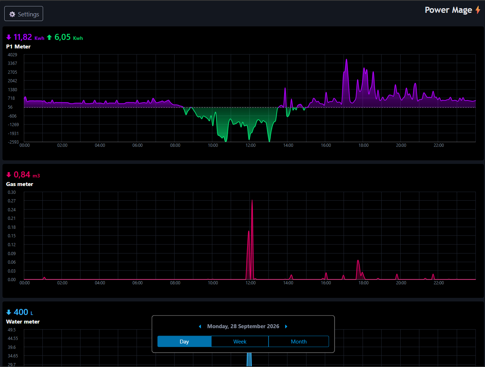
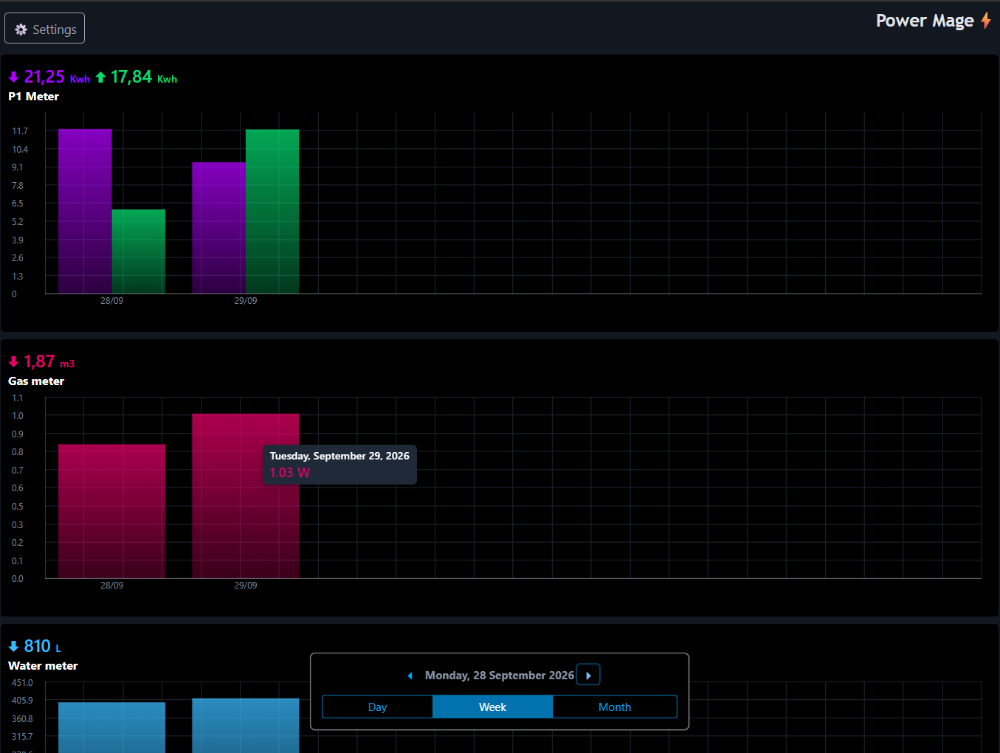
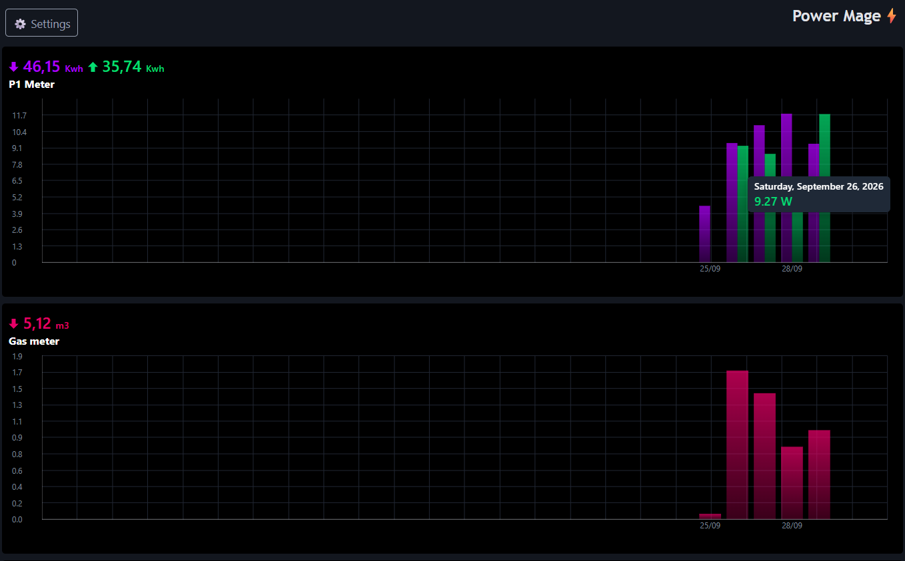
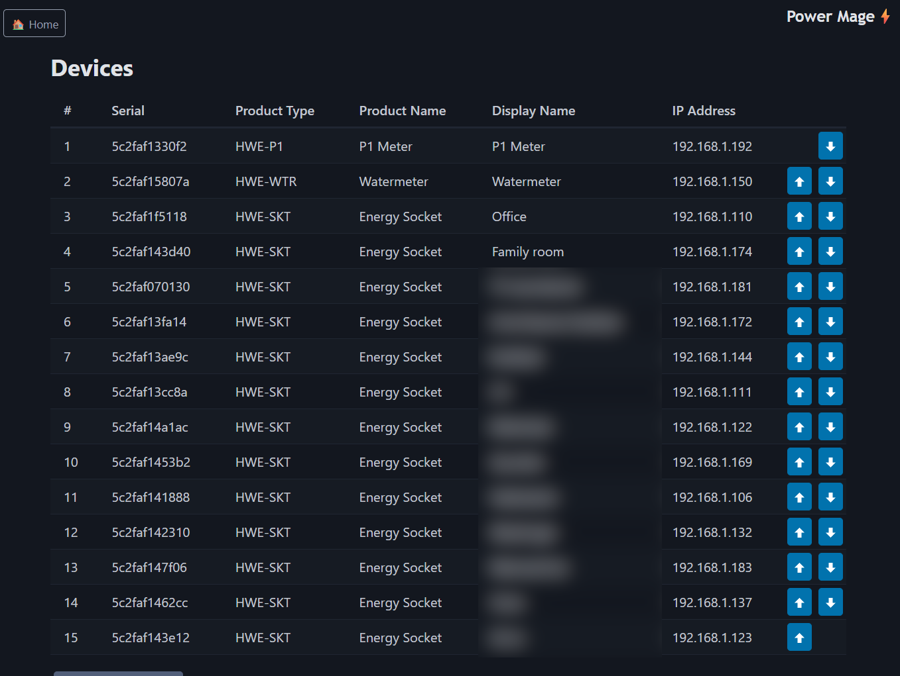

# PowerMage

PowerMage is a self-hosted dashboard and data collector for HomeWizard energy and water devices. It reads device measurements over the local network and stores them locally, so it works without a HomeWizard cloud account or cloud subscription.

Supported device types in the current collector include P1 meters (`HWE-P1`), Energy Socket devices (`HWE-SKT`), and Water meters (`HWE-WTR`). The dashboard shows device measurements over day, week, and month views.

## Screenshots









## How It Works

The solution runs as two Docker containers:

- **PowerMage App** serves the interactive dashboard, device management, and mDNS discovery.
- **PowerMage Collector** polls tracked devices every 30 seconds and records measurements.

Both containers use the same SQLite database at `/app/data/app.db`. In the supplied Compose file, `./data` is mounted at `/app/data` in both containers, so device settings and collected history persist on the host and are shared by the app and collector.

### Local Device Discovery

Open **Devices** and choose **Add new device**. The app sends an mDNS browse query for `_hwenergy._tcp.local` using IPv4 multicast (`224.0.0.251:5353`). Discovered devices are offered in the add-device form; you can also enter a device manually.

Discovery and measurement collection use the local network, not HomeWizard cloud services. The collector requests measurements directly from each device at `http://<device-ip>/api/v1/data`. The app container must be able to receive mDNS multicast from the device LAN, and the collector container must be able to reach the devices' IP addresses. Docker bridge networking does not always forward mDNS between containers and the physical LAN; if discovery does not find devices, configure the host/container networking or an mDNS relay so multicast can reach the app container. The devices must have their local API enabled and be reachable from the Docker host/network.

## Run With Docker Compose

Requirements:

- Docker Engine or Docker Desktop with the Compose plugin.
- Network access from the containers to the HomeWizard devices.
- .NET 10 container images available to the Docker build. The Dockerfiles currently use `registry.docker.local` as the image registry; change those image references to an accessible .NET 10 registry if that hostname is specific to your environment.

The Compose file attaches both services to an external Docker network named `virtual-network`, so create it once if it does not already exist:

```powershell
docker network create virtual-network
docker compose up -d --build
```

To follow startup logs:

```powershell
docker compose logs -f powermage powermage-collector
```

The supplied Compose file does not publish a host port. It adds the `dmz.url` label `http://powermage.docker.local/` for a reverse proxy that understands that label and is connected to `virtual-network`. If you do not use that proxy, publish the app's container port by adding this under the `powermage` service:

```yaml
    ports:
      - "8080:8080"
```

Then open <http://localhost:8080>. Do not publish a port for the collector; it has no web interface.

The SQLite database is stored in `./data/app.db`. Back up the `data` directory while the containers are stopped to make a consistent copy.

## Windows Docker Performance

The default `./data:/app/data` bind mount stores database I/O in a Windows-host directory. On Windows, especially when using Docker Desktop with a WSL 2 backend, file sharing across the Windows/Linux boundary can be slower than Docker-managed storage.

For better database I/O performance, replace the `./data:/app/data` mount on **both** services with the same named volume and declare it at the end of `docker-compose.yml`:

```yaml
services:
  powermage:
    volumes:
      - powermage-data:/app/data

  powermage-collector:
    volumes:
      - powermage-data:/app/data

volumes:
  powermage-data:
```

Docker-managed volumes are stored inside Docker's Linux environment and can avoid the Windows filesystem-sharing overhead. A named volume is separate from the existing `./data` directory, so copy or migrate `app.db` before switching if you need to keep existing history. With a named volume, use `docker compose down` to stop the services; avoid `docker compose down -v` unless you intend to delete the database volume.

## Project Structure

```text
PowerMage/
  Api/                 HomeWizard local API client and measurement models
  Repository/           SQLite-backed device and measurement access
  Services/             mDNS discovery and SQLite initialization
  ServiceCollectionExtensions.cs
PowerMage.App/
  Components/           Blazor dashboard, device management, charts, and settings
  wwwroot/               Static assets and styles
  Program.cs             Web app startup
PowerMage.Collector/
  CollectorHostedService.cs
  Program.cs             Background collector startup
data/                    Persistent SQLite data (created/mounted by Compose)
docker-compose.yml       App and collector service definitions
```